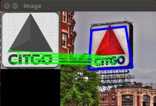
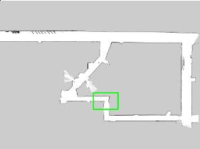
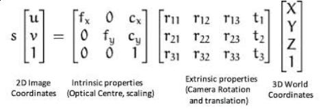
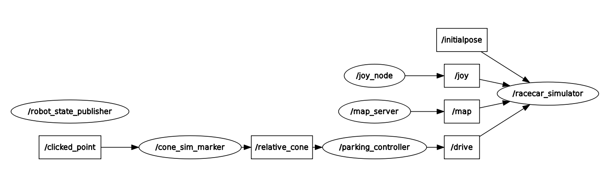
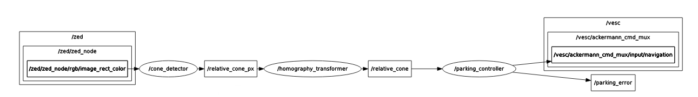

# Lab 4: Vision

| Deliverable | Due Date              |
|---------------|----------------------------------------------------------------------------|
| Briefing    | Monday, March 17th 3:00 - 5:00 PM EST     |
| Code Pushed to Team Website | Monday, March 17th at 11:59 PM|
| Checkoff | Wedensday March 19th |
| [Team Member Assessment](https://docs.google.com/forms/d/e/1FAIpQLSfnnSIP1FSbPQzoFKLAvxCpH1qmOnCrfsf6qtVDNdU5lJED9Q/viewform?usp=dialog) | Wednesday, March 19th at 11:59PM EST |


## Table of Contents
- [Introduction](https://github.com/mit-rss/visual_servoing#introduction)
	- [Lab Modules](https://github.com/mit-rss/visual_servoing#lab-modules)
	- [Submission and Grading](https://github.com/mit-rss/visual_servoing#submission-and-grading)
 	- [Vision Analysis](https://github.com/mit-rss/visual_servoing#vision-analysis)
 	- [Controller Analysis](https://github.com/mit-rss/visual_servoing#controller-analysis)
- [Module 1](https://github.com/mit-rss/visual_servoing#module1)
- [Module 2](https://github.com/mit-rss/visual_servoing#module2)
- [Module 3](https://github.com/mit-rss/visual_servoing#module3)
	- [Launching ZED Camera](https://github.com/mit-rss/visual_servoing#launching-the-zed-camera)
 	- [Accessing Image Data](https://github.com/mit-rss/visual_servoing#accessing-image-data)
  	- [Converting pixel coordinates to x-y coordinates](https://github.com/mit-rss/visual_servoing#converting-pixel-coordinates-to-x-y-coordinates)
  	- [Coordinate Space Conversion](https://github.com/mit-rss/visual_servoing#coordinate-space-conversion)
  	- [Find the Homography Matrix](https://github.com/mit-rss/visual_servoing#find-the-homography-matrix)
- [Module 4](https://github.com/mit-rss/visual_servoing#module-4-controller-for-parking-and-line-following)
- [Synthesis: Bringing it all Together](https://github.com/mit-rss/visual_servoing#synthesis-bringing-it-together-line-following)
  	- [Line Following](https://github.com/mit-rss/visual_servoing#line-following)


## Introduction

Welcome to Lab 4, where you will learn how to use the camera to allow the racecar to park in front of a colored cone and follow a line.

In this lab, your team will do the following:
- Experiment/Prototype with several types of **object detection** algorithms
- Learn how to transform a pixel from an image to a real world plane using **homography matrices**
- Develop a **parking controller** to park your robot in front of an orange cone
- Extend your parking controller into a **line following controller**

### Lab Modules
This lab has a lot. We encourage parallelization by breaking up the components of the lab into 4 distinct modules, which you will combine. Each module tackles an interesting problem in computer vision/controls, and is designed to be implemented (initially) by itself. Afterward, we can combine all parts into a working visual navigation algorithm!  

- [Module 1](#module1): Cone Detection via Color Segmentation
- [Module 2](#module2): Object Detection via Template Matching and SIFT
- [Module 3](#module3): Transforming pixels to a plane via Homography Matrices
- [Module 4](#module4): Writing a parking controller.
- [Synthesis](#synthesis): Deploying all components together; Application to line following.

Here’s how they fit together: Modules 1 and 2 cover object detection algorithms. Module 3 teaches you how to convert a pixel to a plane in the real world. Combining 1 and 3 will tell you where a cone is relative to your robot. Module 4 will park your robot in front of a simulated cone. Combine modules 1, 3, and 4 to park in real life. Now make some modifications to follow a line instead!

## Submission and Grading

Lab 4 will require a briefing and **no report**. You will deliver an 8-minute briefing presentation (plus 3 minutes Q&A) together with your team, upload the briefing slides to your github pages website, and submit a [team member assessment form](https://docs.google.com/forms/d/e/1FAIpQLSfnnSIP1FSbPQzoFKLAvxCpH1qmOnCrfsf6qtVDNdU5lJED9Q/viewform?usp=dialog). See the deliverables chart at the top of this page for due dates and times.

You can view the rubric for the [briefing](https://docs.google.com/document/d/1dGBsSiT4_HnIwpF9Xghsw_nbOH6Ebm37) for more details on specific grading criteria. You will receive a grade out of 10 points. Your final lab grade will also be out of 10 points, based on the following weights:

| Deliverable Grade | Weighting              |
|---------------|----------------------------------------------------------------------------|
| Briefing grade (out of 10)  | 80% |
| Technical Grade (satisfactory completion of all modules) | 20% |

The elements you should include in your Lab 4 presentation include:
- Explanation of vision algorithm strengths and weaknesses. Why does each algorithm perform as it does on each dataset?
- Explanation of the homography transformation. How do we convert pixels to plane coordinates?
- Demonstration of parking controller performance. Make sure you explain and justify the design choices you made in your controller. _Hint: include error plots from **rqt plot**_
- Demonstration of the line-follower. Describe any adjustments you needed to make to your perception and control modules to follow lines. _Hint: include error plots from **rqt plot**_

Please include video, screen shots, data visualizations, etc. in your presentation as evidence of these deliverables. A good presentation will make quantitative and qualitative evaluations of your results.

We provide you with some resources to help you present an effective analysis of your Lab 4 system:

### Vision Analysis
We've provided some code to test the Intersection over Union (IOU) scores of your vision algorithms on the three datasets provided. IOU is a measure of how accurate bounding boxes are, and is a choice metric for analysis of object detection algorithms. Go into **visual_servoing/computer_vision/**  and run:
- python3 cv_test.py citgo
- python3 cv_test.py cone
- python3 cv_test.py map  
To test all three of your algorithms against our citgo, cone, and stata basement datasets respectively. Results will be outputted to .csv files in **scores/**. Some algorithms on some datasets won’t get any/good results. This is expected, and we would like to know why each works for what it does in your presentation.

### Controller Analysis
When you write the parking controller (module 4), you will publish provided error messages. Use **rqt plot** to generate some plots. Try running the following experiments:
- Put a cone directly in front of the car (~3-5 meters away). Your car should drive straight forward and stop in front of the cone. Show us plots of x-error and total-error (x and y error) over time, and be prepared to discuss.
- Run the car on one of our tracks, and check out the plots for any interesting error signals. Compare plots at different speeds, and see how error signals change with speed.

## Module 1: Cone Detection Via Color Segmentation <a name="module1"></a>
In lecture, we learned different ways to detect objects. Sometimes it pays to train a fancy neural net to do the job. Sometimes we are willing to wait and let SIFT find it. Template matching is cool too.

Sometimes simple algorithms are the correct choice. For our purposes, identifying the cone by its distinctive color will prove most effective. Your job in this module will be to identify cones (and other orange objects) and output bounding boxes containing them.

Take a peek at `visual_servoing/computer_vision/color_segmentation.py`. Here you will find your starter code, though there is very little of it. There is a considerable degree of freedom in implementing your segmentation algorithm, and we will try to guide you at a high level. When it comes to opencv functions and examples, googling will not disappoint. Keywords like “python” and “opencv3” will help you avoid c++ and older opencv versions of functions.

The cool thing about this module is that you can build up your algorithm incrementally. Display the original image. Modify, convert, filter, etc. and see what it looks like. Try a different opencv function. See what that does to the already changed image.

Here are some helpful hints:
- As we’ve seen in lecture, there are different color spaces. You are probably used to RGB/BGR, but you’ll find the HUE in HSV varies less with lighting. Try cvtColor.
- The images here are BGR, not RBG.
- Use cv2.inRange to apply a mask over your image, keeping the colors you want.
- Erosion and dilation are a great way to remove outliers and give your cone a bit more of a defined shape.
- OpenCV contour functions can prove very helpful. cv2.findContours + cv2.boundingRect are a powerful combination. Just saying.

Don’t forget conventions! Image indexing works like this (in this lab):


### Evaluation:
We are using the Intersection Over Union (IOU) metric for evaluating bounding box success. Run **python cv_test.py cone color** to test your algorithm against our dataset. We print out the IOU values for you. We expect some sort of analysis involving this metric in your presentation.
By the way- you won’t get them all (probably). But 100% accuracy is not necessary for a great parking controller.


## Module 2: Object Detection via **SIFT** and **Template Matching** <a name="module2"></a>
We’ve taught you some interesting ways to discover objects, and now it’s time to play with them. We want you understanding two critical pieces of information from this module:
- Why these two algorithms are super useful
- Why these two algorithms fail to detect the cone super well

Since the best learning comes from doing, we will be having you use each algorithm where it’s particularly effective. Check out **visual_servoing/computer_vision/test_images_localization** and **visual_servoing/computer_vision/test_images_citgo** to see pictures from two datasets. One dataset contains pictures of the Boston CITGO sign from various angles. The other contains scraps of the stata basement (2D) map.





**CITGO:** Imagine a drone, on a delivery mission. Your target, a workman, called for a sandwich while changing the bulbs in the C on Boston’s most iconic advert. He took a snapshot of the nearest landmark on his cellphone, and we are using that (template) to find him with our camera.

**STATA:** A wheeled robot needs to find its location on a map. It takes a laser scan, and comes up with a local view of what it can see. It tries to locate the local (template) scan on a big map, knowing that the center pixel of the highest scoring bounding box will correspond to its current location. By converting from pixels to meters, the robot will know where it is.

We have two algorithms to implement, SIFT and Template Matching. The goal for this lab will be to get a better feel of the strengths and weaknesses of each algorithm. 

Check out **computer_vision/sift_template.py** in the `visual_servoing` folder. In there you will find two partially completed functions. Each function tries to find a templated image in a larger background image, and returns the bounding box coordinates of the target object in the background.

**On implementing SIFT**      
Test your algorithm against the CITGO dataset. This dataset should give you the stronger results. Run **python3 cv_test.py citgo sift**

**On implementing Template Matching**        
Test your algorithm against the STATA dataset. Run **python3 cv_test.py map template**        

**Testing on Datasets**         
We have implemented a few datasets for you to test your algorithms.  To run the SIFT tests, type in (inside the **computer_vision** folder):
- **python3 cv_test.py cone sift**
- **python3 cv_test.py citgo sift**
- **python3 cv_test.py map sift**            

To test your template matching:
- **python3 cv_test.py cone template**
- **python3 cv_test.py map template**
- **python3 cv_test.py citgo template**            

Some of these algorithm + dataset combinations will not produce good results. Each algorithm has different strong suits. Do you see why?

Note: The templates are all greyscale. We are not doing anything with color in these algorithms.  

## Module 3: Locating the cone via **Homography Transformation** <a name="module3"></a>
In this section, you will use the camera to determine the position of a cone relative to the racecar. This module of the lab involves working on the car.
### Launching the ZED Camera
## Launching the ZED Camera for the first time: 
If you have any trouble please ask a TA! We are here to help. 

Before launching the camera, we need to add two lines to the `run_rostorch.sh` file:
1. ssh into the racecar, but do not spin up the docker.
2. Open the `run_rostorch.sh` file using vim: `vim run_rostorch.sh`

	a. Once in vim press `i` to edit

	b. At the bottom of the file (but *before* the  'staffmitrss/racecar-real:latest' line) insert the following lines: (Note: Some cars already have these lines, if so skip this step.)

 	```
  	-v /usr/local/zed/resources:/usr/local/zed/resources \
  	-v /usr/local/zed/settings:/usr/local/zed/settings \
  	```
  	c. To save and exit, press `ESC` and type `:wq`

	
3. Spin up the docker using `./run_rostorch.sh`
4. \[redacted\] 
5. Run the respective command for your camera. For silver cameras use `zed`, for black cameras use `zed2`.

```bash
# for ZED:
ros2 launch zed_wrapper zed_camera.launch.py camera_model:=zed

# for ZED2:
ros2 launch zed_wrapper zed_camera.launch.py camera_model:=zed2
``` 
6. It might take up to 15 minutes for the camera to download the files it needs and optimize. This only happens once.
7. After that, the camera should turn on! 

## Launching the ZED Camera AFTER first Initialization 
```bash
# on the car

./run_rostorch.sh

# in another terminal

connect

unset DISPLAY  # (only if you did not add this command to your ~/.bashrc file)

#For silver cameras use `zed`, for black cameras use `zed2`

# for ZED:
ros2 launch zed_wrapper zed_camera.launch.py camera_model:=zed

# for ZED2:
ros2 launch zed_wrapper zed_camera.launch.py camera_model:=zed2
```

## Debugging the Camera
- If you see red or an error that there is no config file, call over a TA.  
- If you get an error regarding a missing display, run `unset DISPLAY` before launching the zed. 
- Verifying that the camera is working
	- Open RQT by running `rqt`; use the image view plugin to view the camera feed.
	- Alternatively, you can use rviz and add in a camera topic.
 - The ZED publishes to many topics which you can learn about [here](https://docs.stereolabs.com/integrations/ros/getting-started/#displaying-zed-data). To view them, select the topic name through the dropdown menu. Do not use the depth image for this lab. The one you probably want to use is the default rectified camera: `/zed/zed_node/rgb/image_rect_color`.

### Accessing Image Data
The ZED camera publishes messages of type [Image](http://docs.ros.org/api/sensor_msgs/html/msg/Image.html) from sensor_msgs.
Learn about this message with the  command, `ros2 interface show sensor_msgs/msg/Image`.
The image data is in ROS message data-structure, which is not directly recognized by OpenCV. You might have also learned that OpenCV image representations are sometimes unique (e.g. BGR instead of RGB). To convert between CV image data structures(mat) to ROS image representations(ROS Message structures) you may find [CV bridge](http://wiki.ros.org/cv_bridge/Tutorials/ConvertingBetweenROSImagesAndOpenCVImagesPython) helpful.

### Converting pixel coordinates to x-y coordinates
If you recall from lecture, a camera is a sensor that converts 3D points (x,y,z) into 2D pixels (u,v). If we put on our linear algebra hats, we can project a 3D point onto a 2D plane as follows:



In robotics, we are generally concerned with the inverse problem. Given a 2D (image) point, how can we extract a 3D (world) point?
We need some tools and tricks to make that sort of calculation, as we lost (depth) information projecting down to our 2D pixel. In this lab, we will use another interesting fact about linear transformations to find the X-Y positions of pixels.

### Coordinate space conversion
The racecar can’t roll over or fly (no matter how cool it might look), so the ZED camera will always have a fixed placement with respect to the ground plane. By determining the exact placement, we can compute a function that takes in image pixel coordinates (u, v) and returns the coordinates of the point on the floor (x, y) relative to the car. In other words, the (x,y) coordinate projects onto the pixel (u, v).

This “function” is called a homography. We can’t determine arbitrary 3D points from 2D pixels without lots of extra work. But, we can find 2D world points if those points lie on a plane (and can therefore be thought of as 2D) that is fixed with respect to our camera.

Check out this illustration of a camera and world plane. There exists a linear transformation between the camera projection and the world plane, since the world plane has two dimensions like an image plane.


### Find the Homography Matrix
To find the homography matrix, you should first determine the pixel coordinates of several real world points. You should then measure the physical coordinates of these points on the 2D ground plane. If you gather enough of these point correspondences (at least 4), you have enough information to compute a homography matrix:


Many existing packages including [OpenCV](https://docs.opencv.org/2.4/modules/calib3d/doc/camera_calibration_and_3d_reconstruction.html#findhomography) can be used to compute homography matrices. In `visual_servoing/homography_transformer.py`, you've been provided a node that calls this function for you and makes the conversion between pixel-frame and robot-frame coordinates. You just need to fill in the point correspondences measured from your system.

`rqt image view` will be a useful debugging tool here. If you enable mouse clicking (there is a checkbox next to the topic name), then you can publish the pixel coordinates of points you click on in the image to a topic like this: `/zed/rgb/image_rect_color_mouse_left`. Publish a marker to RVIZ using this pixel (we've provided you with a function `draw_marker` in `visual_servoing/homography_transformer.py`), and you should be able to quickly tell if your homography matrix is doing its job. You may wish to record a ROS bag of camera data and do this testing locally.

## Module 4: Controller for Parking and Line Following <a name="module4"></a>
While your teammates are putting together the computer vision algorithms and localizing the cone, you will also implement a parking controller for the robot. We want you to implement a parking controller that parks your robot in front of a cone at a given distance. The robot will start with the cone in the field of view of the camera and should drive directly to the cone and park in front of it (1.5 - 2 feet from the front). Parking means facing the cone at the correct distance, not just stopping at the correct distance. See an example video [here](https://media.giphy.com/media/v1.Y2lkPTc5MGI3NjExeXUxY3R6dXhnanFjM3lmNnBoeXU1NTEybWE2YjdpMG5mYmNwbnR0ZCZlcD12MV9pbnRlcm5hbF9naWZfYnlfaWQmY3Q9Zw/qELfxUeziNmCWUj7fm/giphy-downsized-large.gif).


The distance and angle don’t act independently, so consider carefully how you should make them work together.

Whenever possible, we want to develop controllers in simulation before deploying on real (breakable) hardware. That is what we’ll do here. After you download (and make) the lab 4 ros package, fire up your **simulator**, and **rviz**.

First, run racecar simulator:

`ros2 launch racecar_simulator simulate.launch.xml`.

Now run `ros2 launch visual_servoing parking_sim.launch.xml`

In rviz, press **publish point** (top options bar) and watch our representation of a cone appear.
Notes
- Make sure to add the marker “/cone_marker” to rviz
- Mke sure you are in the “Map” frame in rviz

If you `ros2 topic echo /relative_cone`, you should be able to see the relative coordinates of the cone in the 'base_link' frame.

Open up `visual_servoing/parking_controller.py`, We’ve subscribed to the “/relative_cone” topic for you, and have set up the publisher/callback as well. Your job is to take the `ConeLocation` message (either print or use a `ros2 interface show vs_msgs/msg/ConeLocation` to find out what is in it), and write a control policy that parks in front of the cone. Publish desired steering angles and velocity just like in lab2.

We aren’t aiming to give you a specific algorithm to run your controller, and we encourage you to play around. Try answering these questions:
- What should the robot do if the cone is far in front?
- What should the robot do if it is too close?
- What if the robot isn’t too close or far, but the cone isn’t directly in front of the robot?
- How can we keep the cone in frame when we are using our real camera?

A good parking controller will work in simulation even when the cone is behind the robot. Of course, when we put this module together with the rest of the lab on the real robot, you won’t have the luxury of knowing the cone location when the camera can’t see it.

Please keep your desired velocities below 1 (meters/sec). Even though the simulator will behave at higher speeds, your real robot will not.

The last thing for you to do is publish the x_error, y_error, and distance (`sqrt(x**2 + y**2)`) error. Use the plot visualization plugin in rqt. You will have ability to view a live plot of (numerical) ros messages. As an example of how it works, you can type `/parking_error/x_error` into the text field in order to plot the x_error over time. The button next to the text field allows you to add multiple topics to plot them at the same time. 


These plots are super useful in controller tuning/debugging (and any other time you need to plot some quantity over time).
Tips:
- Type in the topic you want to graph in the top left of the gui.
- Adjust the axes with the icon that looks like a green checkmark (top left menu bar).

You will be using these plots to demonstrate controller performance for your presentation.

## Synthesis: Bringing it together; Line Following<a name="synthesis"></a>
With your modules in hand, it is time to make your robot park in front of a cone and follow a line.

You can see how your modules will fit together in the following rqt graphs --

**Simulation** (after launching `parking_sim.launch.xml`):

- When you use the PublishPoint tool in RViz, a global location is published to `/clicked_point`.
- The `/cone_sim_marker` node converts `/clicked_point` to the robot frame and publishes it to `/relative_cone`.
- The `/parking_controller` node converts the cone location `/relative_cone` into an appropriate drive command.
- _Simulated parking only requires completion of module 4 (control)_

**Deployment** (after launching `parking_deploy.launch.xml`):

- Now, the cone is localized relative to the real car using your vision algorithm and homography transform.
- The `/cone_detector` node reads frames from the Zed camera; copy over your color segmentation algorithm to extract a cone location in pixels. The pixel cone location is published to `/relative_cone_px`.
- The `/homography_transformer` node converts `/relative_cone_px` from the image (pixel) frame to the robot frame and publishes it to `/relative_cone`.
- The `/parking_controller` node converts the cone location `/relative_cone` into an appropriate drive command (just like in simulation!).
- _Deployed parking requires completion of modules 1 and 3 (perception) as well as 4 (control)_

### Line Following

Now that you and your team have put your modules together to park in front of a cone, a quick modification of your code will create a line follower. The idea is to make the parking controller think that there is always a cone a fixed distance ahead, positioned on the line you want to follow! Like a donkey chasing a carrot, if you restrict the view of your robot to what is a little ahead of it, your parking controller will follow an orange line.

This works by setting a lookahead distance that is greater than your desired parking distance.


Check out [this](https://www.youtube.com/watch?v=uSGnbyWg3_g) demo of what your robot can do.
There will be several tape "courses" set up throughout the lab. Your racecar should be able to drive around them in a controlled manner - not getting lost or cutting corners. Once you can drive around the course, see how fast you can go. You are required to demonstrate successful line following for the orange line.


### General Suggestions
1. Verify your perception system independently after implementing modules 1 and 3 before trying to run it together with the controller. You should be able to move the cone around on the floor and accurately determine its position relative to the car using just the camera. Make sure to visualize the published Marker representing the cone in RViz. The rviz cone should appear where the real cone does.
2. You can verify your parking controller independently as well by running `parking_sim.launch.xml` and placing cones in RViz using the PublishPoint tool. In simulation, your car may observe that a cone is behind it or off to the side; in practice, the car will only know the cone's location when it is in the camera frame. You should design a parking controller that works in all cases!
3. When both perception and control work independently, run them together on the car using `parking_deploy.launch.xml`. Congratulations are in order when you can park successfully.
5. Modify module 1 such that your robot can follow a line instead of a cone -- this should require minimal modification to your parking code! Some suggestions are in the module 1 section below.
6. Improve your line following controller to see how fast you can navigate a circular track.


### Other Tips/FAQ:

**Debugging cone detection on the car**  
The actual cones and orange tape tracks != dataset cones. One useful debug step is to publish live pictures (particularly, the HSV mask). This should let you debug in realtime. We have included a basic debug pipeline already in the template code. We also have included a node in the `parking_deploy.launch.xml` file that compresses the image so it can streamed to your computer at a **much** higher rate. In `rqt image view` select `cone_debug_img_compressed/compressed` to view the compressed topic.

**Fixing missing packages**
If you get errors about certain packages not existing in Docker or that OpenCV doesn't have certain objects, methods, or attributes that our code skeleton assumes exists, run the following:
1. `sudo apt install python3-pip` (if you haven't already)
2. `pip install imutils` (and any other packages that are missing)
3. `pip install opencv-python opencv-contrib-python`  (solution from https://stackoverflow.com/questions/37039224/attributeerror-module-object-has-no-attribute-xfeatures2d-python-opencv-2, fixes xfeatures2d attribute not existing, you might need to use other versions of these packages)

**Racecar switching between zero command**
We always publish a stream of zeros to the controller at some rate for safety reasons. However, this sometimes causes some "stuttering" when you are running your controller, since it is periodically switching between your commands and a zero command. This usually happens when your callback is happening too slowly due to delays in the data stream (especially with cameras) . As data is always susceptible to latency, in many robotics settings you do want to make sure that your commands are being published at a fixed rate instead of awaiting an incoming message.

If you are affected by this, you should first make sure your callbacks are not taking an excessive amount of time. Otherwise, you can address this by maintaining a stateful variable $x$ containing the previous drive message. Then, instead of publishing the drive command, your sensor callback can just modify $x$. You can then have a separate timer callback that publishes $x$ at a fixed Hz. For example:

```python
class MyNode(Node):
	def __init__(self, *args, **kwargs):
		# ...
		initial_drive_kwargs = dict(...)
		self.drive_cmd = AckermanDriveStamped(**inital_drive_kwargs)
		hz = 20 # this should be sufficient, but you can go higher
		self.timer = self.create_timer(1 / hz, self.node_callback)
	def lidar_callback(self, msg):
		cmd = self.process_lidar(msg) # handle lidar data
		self.drive_cmd = cmd
	def timer_callback(self):
		self.drive_pub.publish(self.drive_cmd)
```

Note that this should only affect the real racecar. In sim, the previous drive command is always assumed. 
